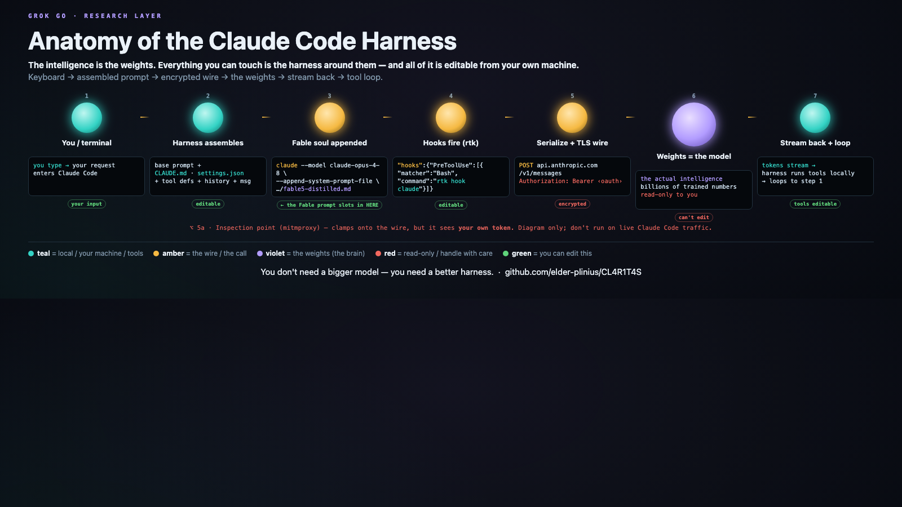
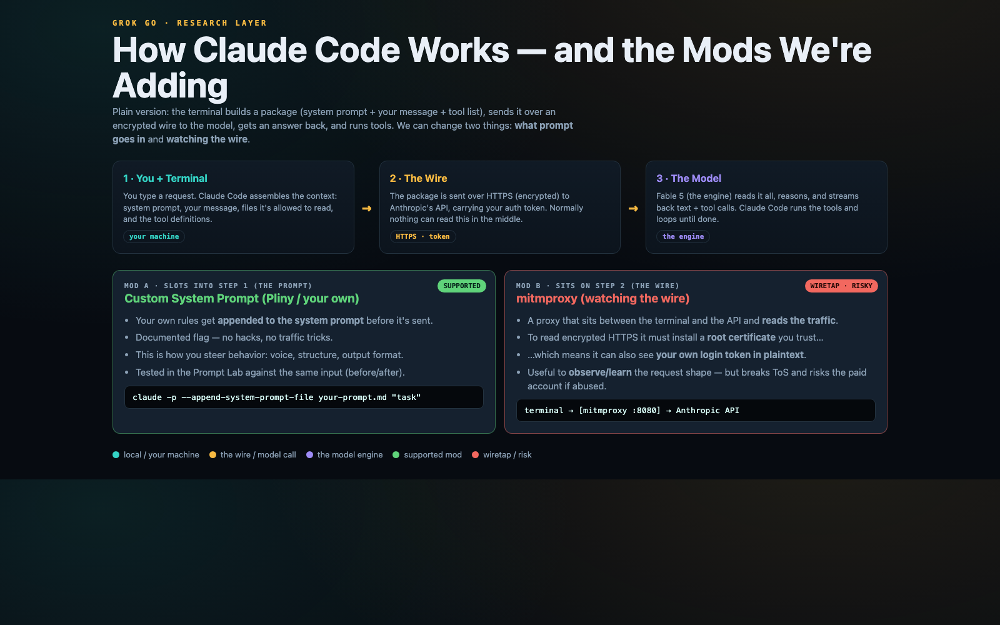
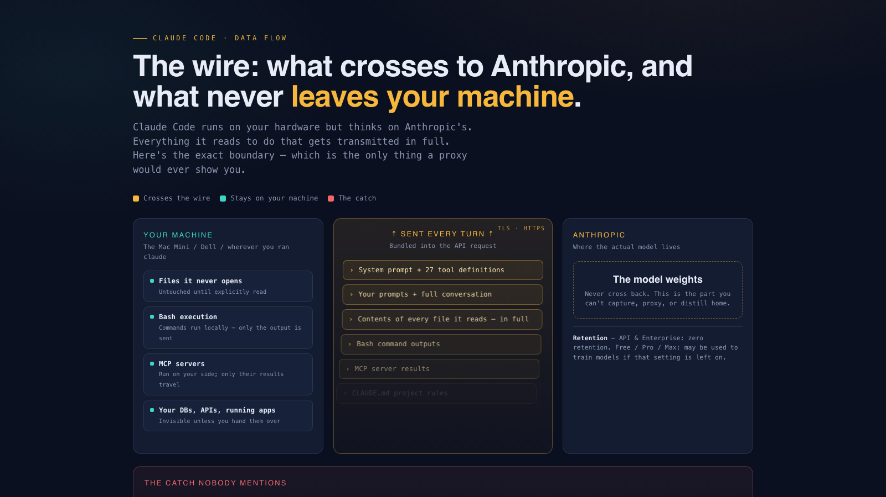
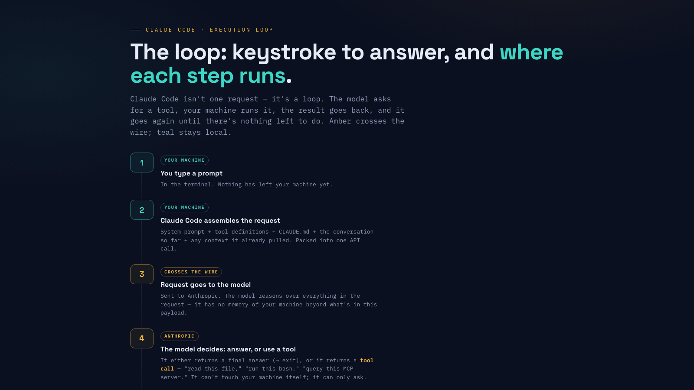
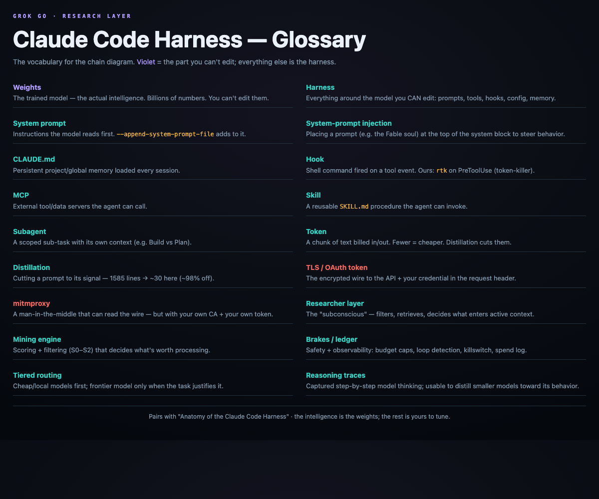

# The Harness Around the Weights
### What actually happens when you run a terminal coding agent — and everything you can edit

*Grok Go research note · 2026-06-15 · companion to the chain visual + glossary*



---

## §0 — TL;DR

When you run a coding agent like Claude Code in your terminal, almost nothing interesting happens
on a secret server you can't see. The chain is mundane and local right up to the last hop: **you
type → the harness assembles a prompt on your own machine → it serializes to JSON → it's sent over
TLS to the model API with your token → the model (its weights) thinks → tokens stream back → the
harness runs tool calls locally and loops.**

There is exactly one part of that chain you cannot edit: the **weights** — the trained model, the
actual intelligence. *Everything else is the harness, and all of it is editable from your own
laptop.* People hunt for "leaked system prompts" as if the magic were hidden there. It isn't. The
magic is the weights (which no prompt gives you), and the leverage is the harness (which is fully
yours). This note documents the whole chain, every editable surface, where we slot a custom
"Fable" personality and why it works, the cost tricks that cut our bill by most of it, and what
can and can't be inspected on the wire.

**Thesis:** *You don't need a bigger model. You need a better harness.*

---

## §1 — The end-to-end chain

Step by step, from keystroke to result:

1. **You type** a message in the terminal (Claude Code, or a fork like OpenClaude).
2. **The harness assembles the request locally.** This is the key insight — the "prompt" the model
   sees is not just your message. It's a stack the harness builds on your machine:
   - the **base system prompt** (the agent's built-in instructions),
   - **CLAUDE.md / AGENTS.md** — your project + global memory files,
   - an **appended system prompt** — where we inject the Fable soul (see §3),
   - **tool definitions** (what the agent is allowed to call) and **permissions**,
   - the **conversation history**,
   - **your message**,
   - **dynamic sections** (current date, environment, working dir, etc.).
3. **Serialize.** All of that is flattened into one JSON payload in the Anthropic Messages API
   shape (`system`, `messages[]`, `tools[]`, …).
4. **The wire.** The JSON is sent over **HTTPS/TLS** to `api.anthropic.com/v1/messages`, with your
   **OAuth/API token** in the `Authorization` header. This is the only network hop. (It's also the
   only place an inspector could sit — see §5.)
5. **The model runs.** Anthropic's servers run the **weights** — the trained parameters that are the
   intelligence — plus server-side safety. This is the part you don't control and can't replicate.
6. **Stream back + loop.** Tokens stream back down the same TLS pipe. When the model emits a
   tool call, the **harness runs that tool locally** (reads a file, runs bash, etc.), feeds the
   result back, and loops from step 2 until the task is done.

Read that list again and notice where the boundary is: steps 1–4 and 6 are **your machine, your
files, your config**. Only step 5 is theirs. The whole rest of this note is about steps 1–4 and 6.

---

## §2 — Every editable part of the harness

This is your entire surface area. Think of it as the column you *can* write to; the weights are the
column you can't.

| Surface | Where | What it changes |
|---|---|---|
| **Permissions / model / hooks** | `~/.claude/settings.json` | which tools are allowed/denied, which model (`claude-opus-4-8`), shell commands fired on tool events |
| **Persistent memory** | `~/.claude/CLAUDE.md` (global) + project `CLAUDE.md` | instructions loaded every session |
| **System prompt** | `--system-prompt[-file]` (replace), `--append-system-prompt[-file]` (add), `--exclude-dynamic-system-prompt-sections` (strip) | the model's first-read instructions |
| **Output styles** | `~/.claude/output-styles/` | behavior/voice presets |
| **Hooks** | `settings.json` → `hooks` | run a shell command on PreToolUse/PostToolUse (ours: a token compressor) |
| **MCP servers** | `claude mcp …` | external tools + data sources |
| **Skills** | `~/.claude/skills/<name>/SKILL.md` | reusable procedures the agent can invoke |
| **Subagents** | agent definitions | scoped sub-tasks with their own context |
| **Context controls** | compaction, `/clear`, prompt caching, `--model` | how much you pay and how fast it runs |

The mental model: **the weights are read-only to you; this table is everything else.** A "custom
agent" is just choices in this table. That's also why an open fork can match the experience — see
**OpenClaude** (§7), a 28.8k★ TypeScript fork of the Claude Code codebase that exposes this same
table but points step 4 at *any* backend (local Ollama, DeepSeek, Gemini, GitHub Models).



---

## §3 — Where the Fable prompt slots in, and why it works

We make a base model "act like Fable" without touching weights. We **append a soul at the
system-prompt layer** (step 2). The exact command (wrapped in `~/grokgo/prompt-lab/cc-with-prompt.sh`
so our default config stays untouched):

```
claude --model claude-opus-4-8 \
       --append-system-prompt-file ~/grokgo/prompt-lab/prompts/fable5-distilled-for-claude-code.md
```

**Why it works:** the appended text rides in the system block the model reads *first*, so it steers
tone, formatting, and decision-style for the whole session. **Why it has limits:** steering ≠
capability. The reasoning still comes entirely from the weights. A prompt can make a model *sound*
like Fable; it cannot make a small model *think* like Fable.

This is the right place to confront the "just train on the traces" idea. There is a public dataset,
**`glint-research/fable-5-traces`** — 4,665 scraped Fable-5 conversation traces with chain-of-thought
annotations (many of them reconstructed by the dataset's authors, not native). It's tempting to think
you could distill those into a local model and get Fable cheaply. You can't get the *capability* that
way: 4,665 mostly-synthetic traces transfer **voice, not reasoning**, and capability lives in
hundreds of billions of weights you don't have. (There are also real ToS/legal caveats to training on
scraped frontier outputs — see our separate `cheaper-fable-strategy.md`.) The honest framing: traces
let you study the *steering*; they don't hand you the *brain*. Our distillation went the other way —
from the **1,585-line** public Fable prompt down to a **~30-line** soul (~98% cut) that keeps the
behavioral signal and drops the web-app machinery. We steer a real frontier model; we don't pretend
to clone one.

We also fold in the **official Fable-5 prompting techniques** (goal-oriented prompting, effort tiers,
`/loop` for autonomy, conciseness over over-engineering, markdown memory files) — legitimate,
published guidance that makes the steering tighter and the frontier calls leaner.

---

## §4 — Cost tricks (the % story)

Most of our spend never reaches a paid API. The levers, with rough savings:

- **rtk (Rust Token Killer)** — a PreToolUse hook that rewrites every `bash` call and compresses
  noisy command output **60–90%** before it re-enters context. Wired in `settings.json`:
  ```
  "hooks": { "PreToolUse": [ { "matcher": "Bash",
    "hooks": [ { "type": "command", "command": "rtk hook claude" } ] } ] }
  ```
- **Prompt distillation** — 1,585-line consumer prompt → ~30 lines (**~98%** cut), signal kept.
- **`/clear` discipline** — reset a bloated session instead of re-billing its whole history every
  turn (we routinely reset a context from ~337k tokens back to fresh).
- **Free-brain routing** — sub-tasks go to free tiers (GitHub Models `gpt-4o-mini`, Gemini CLI);
  the paid frontier model only gets the genuinely hard calls. Target: frontier <10% of calls.
- **Tiered router + ledger + brakes** — a dispatch layer with a spend ledger and a killswitch, so
  cost is visible and capped.
- **Industry contrast** — minimal harnesses like *pi* ship a **<1k-token** system prompt vs the
  **~7–10k** of Claude Code / Cline / OpenCode. Smaller prompt = cheaper every single call.

The compounding point: each lever multiplies. A 98%-smaller prompt *and* 90%-smaller tool output
*and* 90% of work on free models is a different cost regime, not a discount.

---

## §5 — Inspection: what actually leaves your machine

Because step 2 happens locally, you can already **see and edit the exact prompt** before it's sent —
that's what `--append-system-prompt-file` and `--exclude-dynamic-system-prompt-sections` are for. No
interception required to know what's in your own request.



The wire itself (step 4) is TLS to `api.anthropic.com` with your token. Could you put **mitmproxy**
in the middle and read it? Mechanically yes — but honestly: it needs a **root CA** installed, it
would capture **your own OAuth token** in the header, and intercepting live Claude Code traffic
risks your account under ToS. So we **diagram** that inspection point; we don't run it on live
traffic. (Our Ronin checklist —
`~/agent-comms/research/checklists/2026-05-30-null-mitmproxy-claude-oauth-inspection.md` — proved a
sanitized mitmweb inspection + injection layer **on infrastructure we own** (a Null OAuth gateway,
not Claude Code), verified `200 / system_injected:true` through the proxy. That's the legitimate way
to inspect: on your own gateway, with your own credentials, deliberately.) The takeaway for the
"what can they see / what can I see" question: **you can fully see your side; the weights' side stays
server-side; and there's no secret prompt to extract that you didn't already assemble yourself.**

---

## §6 — Secrets-dir hygiene

A production agent handles credentials like a production system, not like a demo. Our pattern:
keep API keys as files under **`~/.secrets/*`**, outside the prompt and outside source control; load
them into the environment at launch; never inline a key in a prompt, a CLAUDE.md, or a commit. And a
hard output rule: **redact `sk-…` / `oat-…` / `Bearer …` strings before anything is surfaced** to a
log, a dashboard, or another agent. The mitmproxy point in §5 is the reason this matters — the one
thing guaranteed to be on the wire is *your own token*, so the whole system is built to never echo it.

---

## §7 — Open-source and local context

The harness is not Anthropic-specific. The same step-2 table exists in the open ecosystem:

- **OpenClaude** (github.com/Gitlawb/openclaude, 28.8k★, MIT-ish, TypeScript) — *forked from the
  Claude Code codebase*, modified to point step 4 at OpenAI-compatible APIs, Gemini, GitHub Models,
  Codex OAuth, **Ollama (local)**, Fireworks, DeepSeek/Qwen/Llama, with built-in cost routing. It's
  the clearest proof that the experience is the *harness*: same loop, swappable brain.
- **OpenCode** (165k★, MIT) — the larger open Claude Code analog: 75+ providers, Build/Plan
  subagents, markdown-defined custom agents, LSP integration.
- Others: OpenHands, Zed's agent, Cline, and minimalist **pi** (<1k-token prompt). Note: the Gemini
  CLI is being retired (2026-06-18) for a closed successor — a reminder to prefer open harnesses.
- **Local inference is real and free.** Xenova's **Transformers.js** runs models **100% locally in
  the browser via WebGPU, no server** — e.g. a 1.7B LLM at ~130 tok/s, and GPT-OSS 20B (q4f16) at
  ~60 tok/s on an M4-class Mac — with one line, `pipeline("text-generation", model, {device:"webgpu"})`.
  On Apple Silicon, MLX/Ollama do the same natively. This is what makes a **local-drafting tier**
  plausible: low-stakes work can run on a free local 7B behind the router, while hard calls still go
  to the frontier model.

The boundary from §0 holds across all of them: open harness, swappable weights, but the *capability*
is always whatever weights you point it at.

---

## §7.5 — Which harness is best? (it's a composition, not a product)

The honest answer to "is Claude Code the best harness, or is there a better one?" is that no single
shipped harness is the winner — each optimizes a different axis, and the best *available* harness is
the one you assemble from their best parts plus your own control layer.

| Harness | Strength | Weakness |
|---|---|---|
| **Claude Code** | best-in-class agent loop: tool use, hooks, skills, subagents, MCP, prompt caching | Anthropic-locked (Claude models only); heavy ~7–10k-token system prompt |
| **pi** | sub-1k-token system prompt — cheapest per call, lean | thinner loop and ecosystem |
| **OpenClaude** | Claude-Code-grade fork that runs against local + many backends | community fork; you self-host the polish |
| **OpenCode** | the big open analog: 75+ providers, Build/Plan subagents, LSP | larger surface to manage |
| **Cursor / Cline / Zed** | excellent IDE-bound coding surfaces | editor-centric, not fleet/agent-centric |

So **the best harness is a composition:** Claude Code's loop quality + OpenClaude's provider
flexibility + pi's lean-prompt discipline + *our* control layer (router, brakes, ledger, receipts,
human gate). Nobody sells that as one box — which is exactly the opportunity this note documents.

How we'd design it, in one line: a **thin lean base prompt → appended soul → deterministic-first
routing** (code/tests → local model → cheap cloud → frontier, each tier earned by failing the one
below with schema validation) **→ hooks for cost → skills/subagents for reuse → markdown memory →
receipts + ledger + brakes + human gate**, over a provider-flexible backend. That is the clean-room
runtime in `cheaper-fable-clean-room-plan.md`.



---

## §7.6 — Badass Fable local proof

The clean-room thesis now has a working local proof, not just a diagram. The `Badass Fable` spike is
a small terminal harness that points an already-running OpenAI-compatible MLX server at a local Qwen
lane (`qwen3.5-4b`) and wraps it with the distilled Fable-style soul plus hard gates. The first
verified proof call returned a valid local response from `http://127.0.0.1:8000/v1` with no paid API
call, no OpenClaude install, no Ollama pull, and no production routing change.

This does **not** mean a 4B local model became Fable. It means the harness can route cheap,
low-stakes work — drafts, triage, summaries, schema checks, receipt prep — through a free local lane
while preserving the escalation rule: hard reasoning and high-consequence decisions still go to the
frontier model and the human approval gate. The local lane is intentionally labeled `draft-only`; it
cannot post, spend, push, trade, edit accounts, or claim it performed actions.

The trace boundary is also part of the proof. Public Hugging Face Fable trace metadata is tracked as
a provenance/risk signal, but raw trace payloads stay quarantined: no chain-of-thought copying, no
few-shot examples, no NotebookLM upload, no training, no preference data, and no claim that scraped
traces transfer frontier capability. The transferable artifact is the harness discipline: routing,
brakes, receipts, source hygiene, and explicit gates.

---

## §8 — Production-agent framing

Put the pieces together and a "production agent" is not a magic model — it's a disciplined harness:

- **Hygiene** — secrets as files + redaction (§6), permissions locked down in `settings.json` (§2).
- **Cost control** — distilled prompt, hooks, free/local routing, ledger + brakes (§4).
- **Inspectability** — you can see your own requests; inspection layers run on infra you own (§5).
- **Reuse** — skills and subagents turn one-off work into repeatable capability (§2).
- **Fleet** — agents addressable by name over a message bus, each with its own soul, routed to the
  cheapest capable brain.
- **Operability** — the boring foundations that make the harness *fast to work in*: the workspace
  under version control (every change a reversible, diff-able backup point), a working local-model
  lane so cheap subtasks never hit a paid API, and a tidy file tree so agents aren't searching four
  directories. These help the operators (human and agent) more than any new model would.

That's the Grok Go bet: a distributed organism where the expensive intelligence is rented by the
call, the harness around it is owned and tuned, and most of the work never touches a paid API.
(Refs: `Null_App_Feature_Requests_and_Integration_Points.md`,
`~/agent-bridge/docs/2026-05-26-null-app-agent-bridge-product-plan.md`.)

---

## §9 — Conclusion

The end-to-end chain is almost entirely yours: you assemble the prompt, you choose the tools, you set
the permissions, you run the tool calls, and you pay for exactly one remote step — the weights doing
the thinking. The leaked-prompt hunt is a category error: the prompt is the steering wheel, and it
was never hidden from you; the engine is the weights, and no prompt or scraped trace gives you those.
So the entire game is the harness — and the harness is editable, inspectable, forkable, and cheap to
run well.

**You don't need a bigger model. You need a better harness.**



---

### Sources
- github.com/Gitlawb/openclaude · OpenCode (openalternative.co, builder.io, pinggy.io)
- huggingface.co/datasets/glint-research/fable-5-traces (4,665 traces, AGPL-3.0)
- Xenova / Transformers.js WebGPU (github.com/huggingface/transformers.js; @xenovacom)
- Official Fable-5 prompting guide (phemex.com, thewincentral.com, alphasignalai.substack.com summaries)
- Internal: `claude-harness-research-notes.md`, `token-savings.md`, `cheaper-fable-strategy.md`,
  `spikes/openclaude-local/openclaude-local-harness-status.md`,
  `spikes/openclaude-local/reasoning-traces-clean-room-policy.md`, Ronin mitmproxy checklist
  (2026-05-30)
