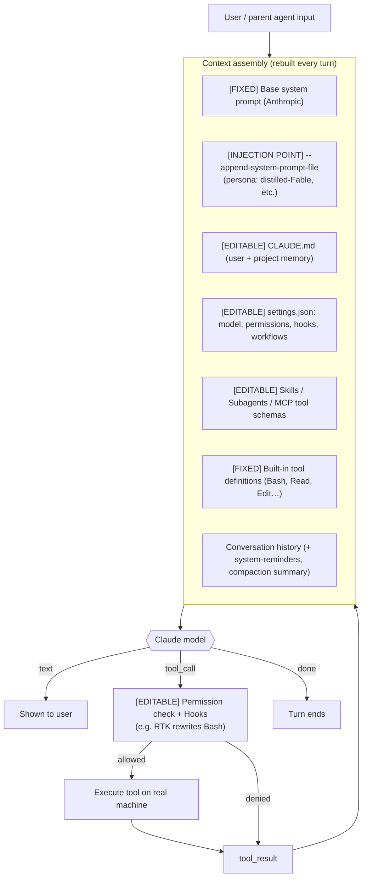

# How the Claude Code Harness Actually Works — End to End

*A working reference for the Grok Go organism. Plain-language but precise. Doubles as a NotebookLM
source and as the spec for the harness diagram + Grok Imagine visuals. Author lane: Fable/Claude.
Status: v1, 2026-06-18.*

## Abstract

"Claude Code" is not the model. It is a **harness**: a loop that assembles a context window, hands it
to a Claude model, receives back text + structured **tool calls**, executes those tools against the
real machine, feeds the results back in, and repeats until the task is done. Almost everything that
makes one Claude Code instance behave differently from another — persona, permissions, token savings,
extra abilities — lives in **editable layers around the model**, not in the model weights. This doc
walks the loop end to end and marks every layer as `[FIXED]` (set by Anthropic), `[EDITABLE]` (you
control it), or `[INJECTION POINT]` (where a custom prompt such as the distilled-Fable / pliny-style
prompt is attached).

## 1. The turn loop (the engine)



The key insight: **the context is reassembled from these layers on every turn.** The model is stateless
between turns; the harness is what carries state, enforces policy, and does the actual work.

## 2. The context stack — what the model "is," layer by layer

| Layer | Editable? | Where it lives | What it controls |
|---|---|---|---|
| Base system prompt | `[FIXED]` | Anthropic, inside Claude Code | Core agent behavior, tool-use protocol |
| **Appended system prompt** | **`[INJECTION POINT]`** | `--append-system-prompt` / `--append-system-prompt-file <path>` | **Persona / voice / extra rules. This is where the Fable prompt (and where a raw pliny prompt *could*) get attached.** |
| Project & user memory | `[EDITABLE]` | `CLAUDE.md`, `~/.claude/CLAUDE.md`, auto-memory | Standing instructions, facts, preferences |
| Settings | `[EDITABLE]` | `.claude/settings.json` | `model`, `permissions` (allow/deny), `hooks`, `enableWorkflows`, dangerous-mode |
| Skills | `[EDITABLE]` | `.claude/skills/*` | On-demand capabilities invoked by name |
| Subagents | `[EDITABLE]` | `.claude/agents/*` | Specialized agent types the main loop can spawn |
| MCP servers | `[EDITABLE]` | settings / config | External tools (e.g. the Librarian's NotebookLM MCP) |
| Built-in tools | `[FIXED]` | Claude Code | Bash, Read, Edit, Write, Grep, Glob, Web*, Task… |
| Hooks | `[EDITABLE]` | `settings.json → hooks` | Intercept tool calls (PreToolUse/PostToolUse). **RTK runs here.** |

## 3. The tool layer + policy (where the machine actually gets touched)

When the model emits a tool call, the harness does **not** run it blindly. It passes through:

1. **Permission mode** `[EDITABLE]` — `default` (ask), `acceptEdits`, `plan` (read-only), or
   `bypassPermissions` / `--dangerously-skip-permissions` (the Fable lane runs this).
2. **Hooks** `[EDITABLE]` — shell commands the harness runs around the tool. In this org, a `PreToolUse`
   hook on `Bash` is `rtk hook claude`, which **rewrites the command through RTK** to cut tokens
   (verified ~84% savings). Hooks can also block or modify a call.
3. **Execution** — the (possibly rewritten) tool runs; stdout/result is captured and fed back as a
   `tool_result` block on the next turn.

So three of the biggest "knobs" — permissions, token-savings, and custom guardrails — are all the
hooks/permissions layer, fully editable, no model change required.

## 4. Context management (compaction)

The window is finite. As history grows, the harness **compacts**: it summarizes older turns into a
condensed block and continues, so a days-long session keeps continuity without overflowing. (This is
exactly what the resumed Fable session did on reload — 491k of history → a summary, with the full
verbatim transcript still on disk in the session `.jsonl`.)

## 5. Multi-agent layers — subagents, workflows, "ultracode"

- **Subagents** (`Task`/Agent tool) — the main loop spawns a fresh agent with its own context to do a
  scoped job and return just the result. Used to keep the main context clean (e.g. digesting a 75k-line
  grok export without loading it all).
- **Workflows** (`Workflow` tool) — deterministic JS that orchestrates *many* subagents (fan-out,
  pipelines, adversarial verification).
- **"Ultracode"** — a standing opt-in that makes the loop default to authoring/running workflows for
  substantial tasks. It's a *posture*, not a model: more thoroughness, more token spend.

## 6. Where the pliny / persona prompt goes (the part you asked to see)

There is exactly **one clean injection point** for a custom persona: `--append-system-prompt-file`.
The grokgo Fable launcher (`cc-fable-resume-dangerous.sh`) wires it like this:

```
claude --name Fable --model claude-opus-4-8 \
       --append-system-prompt-file prompt-lab/prompts/fable5-distilled-for-claude-code.md \
       --dangerously-skip-permissions
```

- The file at that slot is the **distilled, clean-room** Fable prompt (voice/reasoning/honesty/
  boundaries — behavioral patterns, not secrets). **`[EDITABLE]` — swap this file to change persona.**
- The **raw pliny "CLAUDE-FABLE-5-pliny.md" (1585 lines) is kept `reference-only` and is NOT injected**
  (the launcher config asserts `rawPlinyPromptInjected: false`). If someone *wanted* to inject it, the
  slot is the same `--append-system-prompt-file` — but the org's clean-room rule deliberately puts the
  distilled version there instead. **That slot is the editable "where do we stick the prompt" answer.**

Everything else editable (memory, settings, skills, hooks) layers on top, but persona = that one flag.

## 7. End-to-end summary (one breath)

Input arrives → harness assembles `[FIXED base prompt] + [INJECTION: persona file] + [EDITABLE memory/
settings/skills/MCP] + [FIXED tools] + history/compaction` → Claude model returns text + tool calls →
each call passes `[EDITABLE permissions]` + `[EDITABLE hooks: RTK]` → tools run on the real machine →
results loop back → compaction keeps it in-budget → repeat until done; subagents/workflows fan the work
out when needed. Change behavior by editing the layers, not the model.

---

## Appendix A — Visualization seeds (for the diagram + Grok Imagine)

**Diagram:** the mermaid flow in §1 is the master diagram; annotate each node with its `[FIXED]/
[EDITABLE]/[INJECTION POINT]` tag and color-code (grey=fixed, green=editable, amber=injection).

**Grok Imagine image prompts — two styles each (subjects = the harness concept):**

1. *The loop* — "a luminous circular machine that assembles glowing layered panels, feeds them into a
   central mind, receives instructions, and reaches mechanical arms out to touch a physical world, then
   loops back."
   - Ex-Machina style: cold cyan-on-black, brushed metal, volumetric light, glass, clinical lab,
     shallow depth of field, cinematic, Alex Garland aesthetic.
   - Regular style: clean bright infographic, friendly isometric, soft shadows, labeled.
2. *The context stack* — "a translucent vertical stack of editable glass plates around a glowing core;
   one amber plate labeled 'injection point' slides into a slot."
3. *Hooks/permissions gate* — "a command passing through a checkpoint that rewrites it smaller before it
   reaches the machine" (RTK metaphor).
4. *Compaction* — "a long ribbon of memory folding into a small dense crystal without losing its shape."

(Generate each in both Ex-Machina-dark-scifi and clean-regular styles; stitch the sequence into a short
explainer video.)
